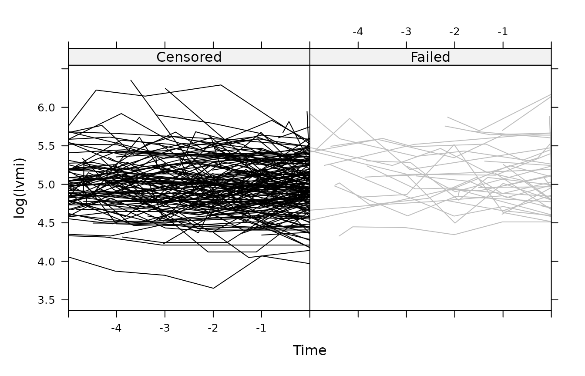

# joineR

## Description

The `joineR` package implements methods for analyzing data from
longitudinal studies in which the response from each subject consists of
a time-sequence of repeated measurements and a possibly censored
time-to-event outcome. The modelling framework for the repeated
measurements is the linear model with random effects and/or correlated
error structure. The model for the time-to-event outcome is a Cox
proportional hazards model with log-Gaussian frailty. Stochastic
dependence is captured by allowing the Gaussian random effects of the
linear model to be correlated with the frailty term of the Cox
proportional hazards model.

## Unbalanced and balanced data formats

A typical protocol for a repeated measurement study specifies a set of
information to be recorded on each subject immediately before or after
randomization, and one or more outcome measures recorded at each of a
set of pre-specified follow-up times. With a slight abuse of
terminology, we refer to the initial information as a set of *baseline
covariates*. These can include any subject-specific time-constant
information, for example measured or categorical characteristics of a
subject, or their treatment allocation in a randomised trial.

A natural way to store the information on baseline covariates is as an
$`n`$ by $`p
+ 1`$ array or data-frame, in which $`n`$ is the number of subjects,
$`p`$ the number of baseline covariates, and an additional column
contains a unique subject identifier. It is then natural to store the
follow-up measurements of each outcome variable as an $`n`$ by $`m + 1`$
data-frame where $`m`$ is the number of follow-up times and the
additional column contains the subject-identifier with which we can link
outcomes to baseline covariates. For completeness, we note that the
follow-up times will often be unequally spaced, and should be stored as
a vector of length $`m`$ to avoid any ambiguity. This defines a
*balanced* data-format, the term referring to the common set of
information intended to be obtained from each subject.

In observational studies, and in designed studies with non-hospitalized
human subjects, it is difficult or impossible to insist on a common set
of follow-up times. In such cases, the usual way to store the data is as
an array or data-frame with a separate row for each follow-up
measurement and associated follow-up time on each subject, together with
the subject identifier and any other covariate information, repeated
redundantly over multiple follow-up times on the same subject. This
defines the *unbalanced* data-format, so-called because it allows the
number and timing of follow-up measurements to vary arbitrarily between
patients.

In practice, the unbalanced *data-format* is also widely used to store
data from a balanced *study-design*, despite its in-built redundancy.
Conversely, the balanced format can be used to store data from an
unbalanced design, by defining the time-vector to be the complete set of
distinct follow-up times and using `NA`’s to denote missing follow-up
measurements. In practice, unless the data-set derives from a balanced
design with no missing values, the choice between the two formats
reflects a compromise between storing redundant information in the
unbalanced format and generating a possibly large number of `NA`’s in
the balanced format.

## Motivating Examples

The package includes five data-sets: `heart.valve`, `liver`, `mental`,
`epileptic`, and `aids`. Descriptions of each follow.

### The `heart.valve` data-set

This data-set is derived from a study of heart function after surgery to
implant a new heart valve, and is loaded (after installing the package)
with the command:

``` r

library(joineR)
library(survival)
data(heart.valve)
```

The data refer to 256 patients and are stored in the *unbalanced*
format, which is convenient here because measurement times were unique
to each subject. The data are stored as a single `R` object,
`heart.valve`, which is a data-frame of dimension 988 by 25. The average
number of repeated measurements per subject is therefore 3.859375. As
with any unbalanced data-set, values of time-constant variables are
repeated over all rows that refer to the same subject. The
dimensionality of the dataset can be confirmed by a call to the
[`dim()`](https://rdrr.io/r/base/dim.html) function, whilst the names of
the 25 variables can be listed by a call to the
[`names()`](https://rdrr.io/r/base/names.html) function:

``` r

dim(heart.valve)
```

    ## [1] 988  25

``` r

names(heart.valve)
```

    ##  [1] "num"          "sex"          "age"          "time"         "fuyrs"       
    ##  [6] "status"       "grad"         "log.grad"     "lvmi"         "log.lvmi"    
    ## [11] "ef"           "bsa"          "lvh"          "prenyha"      "redo"        
    ## [16] "size"         "con.cabg"     "creat"        "dm"           "acei"        
    ## [21] "lv"           "emergenc"     "hc"           "sten.reg.mix" "hs"

To extract the subject-specific values of one or more baseline
covariates from a data-set in the unbalanced format, we use the function
`UniqueVariables`. The three arguments to this function are: the name of
the data-frame; a vector of column names or numbers of the data-frame
that identify the required baseline covariates; the column name or
number of the data-frame that identifies the subject. For example, to
select the baseline covariates `emergenc`, `age` and `sex` from the
data-frame `heart.valve` and assign these to a new `R` object, we use
the command:

``` r

heart.valve.cov <- UniqueVariables(
  heart.valve, 
  c("emergenc", "age", "sex"),
  id.col = "num")
```

The resulting data-frame `heart.valve.cov` has four columns,
corresponding to the subject identifier and the three extracted baseline
covariates; hence for example:

``` r

heart.valve.cov[11:15, ]
```

    ##    num      age emergenc sex
    ## 11  11 70.56712        0   0
    ## 12  12 50.97534        0   0
    ## 13  13 69.94247        0   1
    ## 14  14 72.30685        0   0
    ## 15  15 42.40000        1   0

To extract all of the baseline covariates, it is easier to identify the
required columns by number, hence:

``` r

heart.valve.cov <- UniqueVariables(
  heart.valve, 
  c(2, 3, 5, 6, 12:25), 
  id.col = "num")

dim(heart.valve.cov)
```

    ## [1] 256  19

Notice that the dimension of `heart.valve.cov` is 256 (the number of
subjects) by 19 (one more than the number of covariates). An analysis of
these data is reported in Lim et al. (2008).

### The `liver` data

This data-set is taken from Andersen et al. (1993). It concerns the
measurement of liver function in cirrhosis patients treated either with
standard or novel therapy.

The data-set is included with the package as a single `R` object, which
can be accessed as follows:

``` r

data(liver)
dim(liver)
```

    ## [1] 2969    6

``` r

names(liver)
```

    ## [1] "id"          "prothrombin" "time"        "treatment"   "survival"   
    ## [6] "cens"

This data-set is stored in the balanced format. It contains longitudinal
follow-up information on each subject, a solitary baseline covariate
representing the respective therapy arm, and time-to-event information
(time and censoring indicator) for each subject.

Subsets of the data can be accessed in the usual way. For example,

``` r

liver[liver$id %in% 29:30, ]
```

    ##    id prothrombin       time treatment  survival cens
    ## 33 29          59 0.00000000         0 0.1013699    0
    ## 34 30          51 0.00000000         0 0.1068493    1
    ## 35 30          75 0.09863014         0 0.1068493    1

shows that subject 29 provided only one measurement, at time $`t = 0`$,
and was lost-to-follow up at time $`t = 0.1013699`$ years (`cens = 0`),
whilst subject 30 provided two measurements, at times $`t = 0`$ and
$`t = 0.09863014`$ years, and died at time $`t = 0.1068493`$ years
(`cens = 1`).

### The `mental` data-set

This data-set relates to a study in which 150 patients suffering from
chronic mental illness were randomised amongst three different drug
treatments: placebo and two active drugs. A questionnaire instrument was
used to assess each patient’s mental state at weeks 0, 1, 2, 4, 6 and 8
post-randomization. The data can be loaded with the command:

``` r

data(mental)
```

Only sixty-eight of the 150 subjects provided a complete sequence of
measurements at weeks 0, 1, 2, 4, 6 and 8. The remainder left the study
prematurely for a variety of reasons, some of which were thought to be
related to their mental state. Hence, dropout is potentially
informative. The data from the first five subjects can be accessed in
the usual way:

``` r

mental[1:5, ]
```

    ##   id Y.t0 Y.t1 Y.t2 Y.t4 Y.t6 Y.t8 treat n.obs surv.time cens.ind
    ## 1  1   55   NA   NA   NA   NA   NA     2     1     0.704        0
    ## 2  2   44   NA   NA   NA   NA   NA     1     1     0.740        0
    ## 3  3   65   67   NA   NA   NA   NA     2     2     1.121        1
    ## 4  4   64   56   NA   NA   NA   NA     2     2     1.224        1
    ## 5  5   47   48   NA   NA   NA   NA     2     2     1.303        0

The data are stored in the balanced format, with 150 rows (one per
subject) and 11 columns comprising a subject identifier, the measured
values from the questionnaire at each if the six scheduled follow-up
times, the treatment allocation, the number of non-missing measured
values, an imputed dropout time and a censoring indicator, coded as 1
for subjects who dropped out for reasons thought to be related to their
mental health state, and as 0 otherwise. Note the distinction made here
between potentially informative dropout and censoring, the latter being
assumed to be uninformative. Hence, the command

``` r

table(mental$cens[is.na(mental$Y.t8)])
```

    ## 
    ##  0  1 
    ## 21 61

shows that 21 of the 82 dropouts did so for reasons unrelated to their
mental health.

### The `epileptic` data-set

This data-set is derived from the SANAD (Standard and New Antiepileptic
Drugs) study, described in Marson et al. (2007). SANAD was a randomised
control trial to compare standard (CBZ) and new (LTG) anti-epileptic
drugs with respect to their effects on long-term clinical outcomes. The
data are stored in the unbalanced format. The data for each subject
consist of repeated measurements of calibrated dose, several baseline
covariates and the time to withdrawal from the drug to which they were
randomised. The first three rows, all of which relate to the same
subject, can be accessed as follows:

``` r

data(epileptic)
epileptic[1:3, ]
```

    ##   id dose time with.time with.status with.status2 with.status.uae
    ## 1  1    2   86      2400           0            0               0
    ## 2  1    2  119      2400           0            0               0
    ## 3  1    2  268      2400           0            0               0
    ##   with.status.isc treat   age gender learn.dis
    ## 1               0   CBZ 75.67      M        No
    ## 2               0   CBZ 75.67      M        No
    ## 3               0   CBZ 75.67      M        No

### The `aids` data-set

This data-set is from a randomised clinical trial comparing the drug
didanosine (ddI) with zalcitabine (ddC) in HIV-infected patients who had
failed or were intolerant of zidovudine (AZT) therapy, described in
Goldman et al. (1996). The data contain repeated measurements of CD4
cell count along with time-to-death information for each patient. The
data can be loaded as follows:

``` r

data(aids)
dim(aids)
```

    ## [1] 1405    9

``` r

names(aids)
```

    ## [1] "id"      "time"    "death"   "CD4"     "obstime" "drug"    "gender" 
    ## [8] "prevOI"  "AZT"

## Converting between balanced and unbalanced data-formats

Two functions are provided to convert objects from one format to the
other. The following code demonstrates the conversion of the `mental`
data-set from the balanced to the unbalanced format, including a
mnemonic re-naming of the column that now contains all of the repeated
measurements:

``` r

mental.unbalanced <- to.unbalanced(mental, id.col = 1,
                                   times = c(0, 1, 2, 4, 6, 8),
                                   Y.col = 2:7, other.col = 8:11)
names(mental.unbalanced)
```

    ## [1] "id"        "time"      "Y.t0"      "treat"     "n.obs"     "surv.time"
    ## [7] "cens.ind"

``` r

names(mental.unbalanced)[3] <- "Y"
```

The following code converts the new object back to the balanced format:

``` r

mental.balanced <- to.balanced(mental.unbalanced, id.col = 1,
                               time.col = 2,
                               Y.col = 3, other.col = 4:7)
dim(mental.balanced)
```

    ## [1] 150  11

``` r

names(mental.balanced)
```

    ##  [1] "id"        "Y.t0"      "Y.t1"      "Y.t2"      "Y.t4"      "Y.t6"     
    ##  [7] "Y.t8"      "treat"     "n.obs"     "surv.time" "cens.ind"

Note the automatic renaming of the repeated measures according to their
measurement times, also that this function does not check whether
storing the object in the balanced format is sensible. For example,
conversion of the `epileptic` data to the balanced format leads to the
creation of a large array, most of whose values are missing:

``` r

epileptic.balanced <- to.balanced(epileptic,
                                  id.col = 1, time.col = 3,
                                  Y.col = 2, other.col = 4:12)
dim(epileptic.balanced)
```

    ## [1]  605 1006

``` r

sum(is.na(epileptic.balanced))
```

    ## [1] 599783

Once a data-set is in the balanced format (if it is unbalanced then
`to.balanced` can be applied) then the mean, variance and correlation
matrix of the responses can be extracted using `summarybal`. An example
is given below using the mental data-set:

``` r

summarybal(mental, Y.col = 2:7, times = c(0, 1, 2, 4, 6, 8), 
           na.rm = TRUE)
```

    ## $mean.vect
    ##      x        y
    ## Y.t0 0 55.77333
    ## Y.t1 1 53.03378
    ## Y.t2 2 50.37008
    ## Y.t4 4 48.62963
    ## Y.t6 6 46.94048
    ## Y.t8 8 46.02941
    ## 
    ## $variance
    ##     Y.t0     Y.t1     Y.t2     Y.t4     Y.t6     Y.t8 
    ## 132.1228 152.7403 167.5366 168.6653 228.8759 181.4917 
    ## 
    ## $cor.mtx
    ##           [,1]      [,2]      [,3]      [,4]      [,5]      [,6]
    ## [1,] 1.0000000 0.5939982 0.4537496 0.4186798 0.3432355 0.2997679
    ## [2,] 0.5939982 1.0000000 0.7793311 0.6805021 0.6631543 0.6149448
    ## [3,] 0.4537496 0.7793311 1.0000000 0.7992470 0.7077238 0.6202277
    ## [4,] 0.4186798 0.6805021 0.7992470 1.0000000 0.8108585 0.7402240
    ## [5,] 0.3432355 0.6631543 0.7077238 0.8108585 1.0000000 0.8681933
    ## [6,] 0.2997679 0.6149448 0.6202277 0.7402240 0.8681933 1.0000000

## Creating a `jointdata` object

A `jointdata` object is a list consisting of up to three data-frames,
which collectively contain repeated measurement data, time-to-event data
and baseline covariate data. The repeated measurement data must be
stored in the unbalanced format. The time-to-event and baseline
covariate data must each be stored in the balanced format, i.e. with one
line per subject. Each data-frame must include a column containing the
subject id, and all three subject id columns must match. The
`UniqueVariables` function provides a convenient way to extract the
time-to-event and base line covariate data from an unbalanced
data-frame, as in the following example.

``` r

liver.long <- liver[, 1:3]
liver.surv <- UniqueVariables(liver, var.col = c("survival", "cens"), 
                              id.col = "id")
liver.baseline <- UniqueVariables(liver, var.col = 4,
                                  id.col = "id")

liver.jd <- jointdata(longitudinal = liver.long,
                      survival = liver.surv, 
                      baseline = liver.baseline,
                      id.col = "id",
                      time.col = "time")
```

As a second example, we create a `jointdata` object from the single
data-frame `heart.valve` as follows:

``` r

heart.surv <- UniqueVariables(heart.valve, var.col = c("fuyrs", "status"),
                              id.col = "num")
heart.long <- heart.valve[, c(1, 4, 5, 7, 8, 9, 10, 11)]
heart.jd <- jointdata(longitudinal = heart.long, 
                      survival = heart.surv,
                      id.col = "num",
                      time.col = "time")
```

A summary of a `jointdata` object can be obtained using the `summary`
function. For example:

``` r

summary(heart.jd)
```

    ## $subjects
    ## [1] "Number of subjects: 256"
    ## 
    ## $longitudinal
    ##            class
    ## time     numeric
    ## fuyrs    numeric
    ## grad     numeric
    ## log.grad numeric
    ## lvmi     numeric
    ## log.lvmi numeric
    ## ef       integer
    ## 
    ## $survival
    ##                                  
    ## Number of subjects that fail:  54
    ## Number of subjects censored:  202
    ## 
    ## $baseline
    ## [1] "No baseline covariates data available"
    ## 
    ## $times
    ## [1] "Unbalanced longitudinal study or more than twenty observation times"

A `jointdata` object can also be constructed from any specified subset
of subjects. For example,

``` r

take <- heart.jd$survival$num[heart.jd$survival$status == 0]
heart.jd.cens <- subset(heart.jd, take)
```

selects only those subjects whose survival status is zero, i.e. their
event-time is right-censored.

The `sample` function can also be used to select a random sample of
subjects from a `jointdata` object, for example:

``` r

set.seed(94561)
heart.jd.sample <- sample.jointdata(heart.jd, size = 10)
```

takes the data from a random sample of 10 out of the 150 subjects and
assigns the result to a `jointdata` object named `heart.jd.sample`.

## Plotting a `jointdata` object

The default operation of the generic `plot` function applied to a
`jointdata` object is a plot of longitudinal profiles of the repeated
measurements. If the object contains more than one longitudinal
variable, each is presented in a separate panel. For example, the
command `plot(heart.jd)` produces the following figure:

``` r

plot(heart.jd)
```


A useful device for the joint exploratory analysis of longitudinal and
time-to-event data is to compare longitudinal profiles amongst sub-sets
of subjects selected according to their associated time-to-event, or
specified ranges thereof, possibly in combination with other selection
criteria such as treatment allocation or other baseline covariates. This
can be done by applying the `plot` function to subsets of the data. For
example, the figure below shows the longitudinal variable `gradient` in
the heart data set as a pair of plots, with the two sub-sets of subjects
chosen according to whether their time-to-event outcome was or was not
censored. The figure is generated by the commands:

``` r

par(mfrow = c(1, 2))
plot(heart.jd.cens, Y.col = 4, main = "gradient: censored")
take <- heart.jd$survival$num[heart.jd$survival$status == 1]
heart.jd.uncens <- subset(heart.jd, take)
plot(heart.jd.uncens, Y.col = 4, main = "gradient: failed")
```


Plots can be modified in the usual way by specifying graphical
parameters through the `par` function, or by adding `points` and/or
`lines` to an existing plot.

Another useful exploratory device is a plot that considers the
longitudinal trajectory of each subject prior to departure from the
study, for whatever reason, with the time-scale for each subject shifted
so that their last observed longitudinal measurement is taken as time
zero. This can help to reveal patterns of longitudinal measurements,
e.g. an atypically increasing or decreasing trajectories, that may be
related to drop-out.

The function `jointplot` produces a plot of this kind. As an example, we
consider the heart dataset, using the log of the left ventricular mass
index as the longitudinal variable of interest. The column containing
the censoring indicator in the survival component of the `jointdata`
object must be specified. The default for the `jointplot` function is to
split the profiles according to the censoring indicator.

``` r

jointplot(heart.jd, 
          Y.col = "log.lvmi", Cens.col = "status", 
          lag = 5, 
          col1 = "black", col2 = "gray", ylab = "log(lvmi)")
```



Further arguments can be used to label and colour the plot to suit the
user, as well as options to add a (smoothed) mean profile.

## Exploring covariance structure

An important component of any joint model is the covariance structure of
the longitudinal measurements. For balanced longitudinal data, the
simplest way to explore the covariance structure is to fit a provisional
model for the mean response profiles by ordinary least squares and apply
the `var` function to the matrix of residuals. Note, however, that any
mis-specification of the assumed model for the mean response profiles
will lead to biased estimates of the residual covariance structure,
hence at this stage over-fitting is preferable to under-fitting. For
example, in a randomised trial of two or more treatments with a common
set of follow-up times for all subjects, we would recommend fitting a
saturated treatments-by-times model for the mean response profiles, as
in the following example.

``` r

y <- as.matrix(mental[, 2:7])
means <- matrix(0, 3, 6)

for (trt in 1:3) {
   ysub <- y[mental$treat == trt, ]
   means[trt,] <- apply(ysub, 2, mean, na.rm = TRUE)
}

residuals <- matrix(0, 150, 6)

for (i in 1:150) {
   residuals[i,] <- y[i,] - means[mental$treat[i], ]
}

V <- cov(residuals, use = "pairwise")
R <- cor(residuals, use = "pairwise")
round(cbind(diag(V), R), 3)
```

    ##         [,1]  [,2]  [,3]  [,4]  [,5]  [,6]  [,7]
    ## [1,] 131.774 1.000 0.612 0.472 0.464 0.391 0.321
    ## [2,] 142.171 0.612 1.000 0.766 0.663 0.650 0.603
    ## [3,] 159.711 0.472 0.766 1.000 0.792 0.712 0.624
    ## [4,] 153.364 0.464 0.663 0.792 1.000 0.799 0.738
    ## [5,] 198.350 0.391 0.650 0.712 0.799 1.000 0.861
    ## [6,] 167.886 0.321 0.603 0.624 0.738 0.861 1.000

Note that the variances show no strong relationship with time, and that
the correlations decrease with increasing distance from the diagonal.

For unbalanced longitudinal data, direct calculation of a covariance
matrix is unwieldy at best, and impossible if follow-up times are
completely irregular. In these circumstances, an alternative exploratory
device is the variogram. This makes use of the theoretical result that
for any two random variables, $`A`$ and $`B`$ say, with common
expectation,

\$\${\rm E}\left\[\frac{1}{2}(A-B)^2\right\] = {\rm Var}(A)+{\rm
Var}(B) - 2 {\rm Cov}(A,B).\$\$

In the present context, let $`R_{ij}`$ denote the residual associated
with the $`j`$th measurement on the $`i`$th subject, and $`t_{ij}`$ the
corresponding measurement time. If we are willing to assume that the
$`R_{ij}`$ have a common variance $`\sigma^2`$ and that the correlation
between any two residuals on the same subject depends only on the
time-separation between them, so that \${\rm Corr}(R\_{ij},R\_{ik}) =
\rho(u\_{ijk})\$, where $`u_{ijk}=|t_{ij} - t_{ik}|`$, it follows that

\$\${\rm E}\left\[\frac{1}{2}(R\_{ij} - R\_{ik})^2\right\] =
\sigma^2\\1 - \rho(u\_{ijk})\\.\$\$

A scatterplot of the $`u_{ijk}`$ against
$`v_{ijk} = \frac{1}{2}(R_{ij} -
R_{ik})^2`$ is called a *variogram cloud*, whilst a smoothed version,
obtained by averaging the $`v_{ijk}`$ within pre-specified intervals of
$`u_{ijk}`$, is called the *sample variogram*. The function `variogram`
calculates the variogram cloud. This function has an associated method
for the `plot` function that can display the variogram cloud, the sample
variogram or both, as required.

``` r

vgm <- variogram(indv = mental.unbalanced[, 1], 
                 time = mental.unbalanced[, 2], 
                 Y = mental.unbalanced[, 3])
vgm$sigma2
```

    ## [1] 176.3937

The figure below shows the result of the following three calls to the
`plot` function. Note that whilst the default for plotting a variogram
object is to show both the cloud and the sample variogram, the sample
variogram is almost always the more useful as a pointer to the
underlying correlation structure of the data.

``` r

par(mfrow = c(1, 3))
plot(vgm$svar[, 1], vgm$svar[, 2], 
     pch = 19, cex = 0.5, 
     xlab = "u", ylab = "V(u)")
plot(vgm, points = FALSE, ylim = c(0, 200)) 
plot(vgm)
```


## Model-fitting

The package includes functions for fitting two different classes of
model using maximum likelihood estimation. The first is an extended
version of the random effects model proposed by Wulfsohn and Tsiatis
(1997). See Henderson et al. (2000). The second is the transformation
model described by Diggle et al.  (2008).

### The random effects model

In the extended Wulfsohn and Tsiatis model, both the subject-specific
mean response for the repeated measurements and the subject-specific
hazard for the time-to-event outcome depend on latent random effect
vectors. Hence, if $`\lambda_i(t)`$ denotes the hazard for subject $`i`$
and $`Y_{ij}`$ the $`j`$-th repeated measurement on subject $`i`$, the
model specifies latent vectors $`U_i`$ and $`V_i`$ to follow zero-mean
multivariate normal distributions, realized independently for different
subjects. Conditional on $`U_i`$ and $`V_i`$, the repeated measurements
sub-model is

``` math
Y_{ij} = x_{ij} \beta + a_{ij}^\top U_i + Z_{ij},
```

and the hazard sub-model is

``` math
\lambda_i(t) = \lambda_0(t) \exp(w_{ij} \alpha + b_{ij}^\top V_i).
```

In the above, the $`x_{ij}`$, $`w_{ij}`$, $`a_{ij}`$ and $`b_{ij}`$ are
vectors of explanatory variables that may be time-constant or
time-varying, and the $`Z_{ij}`$ are mutually independent, \$Z\_{ij}
\sim {\rm N}(0, \tau^2)\$. In principle, this is a very flexible model.
In practice, the computational cost of evaluating the likelihood
restricts routine implementation of the model to low-dimensional $`U_i`$
and $`V_i`$. Wulfsohn and Tsiatis (1997) considered the special case in
which the repeated measurements follow the so-called random intercept
and slope model with $`a_{ij}^\top  = (1, t_{ij})`$, whilst the random
effects for the repeated measurement and time-to-event sub-models are
proportional, hence $`b_{ij}^\top V_i = \phi a_{ij}^\top U_i`$.

The function provided in the `joineR` package for fitting
Wulfsohn-Tsiatis models is `joint`, which allows the user to choose from
three models for the joint random effects: random intercept; random
intercept and slope; quadratic random effects.

The first argument to `joint` is a `jointdata` object that provides the
data to be analysed. The following two arguments specify the
longitudinal and survival sub-models, making use of the regular
`R formula` syntax, including incorporating a `Surv` object as the
response in the survival sub-model for compatibility with the `R`
function `coxph` from the `survival` package. The next argument `model`
allows the user to choose one of the three candidate random effects
models, and defaults to the random intercept and slope case. Setting
`model = "int"` and `model = "quad"` will fit a random intercept only
and random quadratic joint model respectively.

The functions to fit a joint random effects model have options to fit
the repeated measurement sub-model and the hazard sub-model separately.

The syntax for `joint` is best seen via examples. We will fit the joint
random effect model to the `mental` data-set with the sub-models:

``` math
\begin{eqnarray*}
  \mbox{longitudinal sub-model:  } & Y_{ij} = X_{i1}^\top \beta_1 + U_{0i} + Z_{ij} \\
  \mbox{hazard sub-model:  } & h_i(t) = h_0(t) \exp{\{ X_{i2}^\top \beta_2 + \gamma U_{0i} \}} \\
\end{eqnarray*}
```

To do this, we first create a `jointdata` object for these data, using
the unbalanced form of the data defined earlier.

``` r

mental.long <- mental.unbalanced[, 1:3]
mental.surv <- UniqueVariables(mental.unbalanced, 
                               6:7, id.col = 1)
mental.baseline <- UniqueVariables(mental.unbalanced,
                                   4, id.col = 1)
mental.jd <- jointdata(mental.long, 
                       mental.surv,
                       mental.baseline,
                       id.col = "id", 
                       time.col = "time")
```

The following command then fits the model. Note that in the function
call, the `Y ~ 1` and `Surv(surv.time, cens.ind) ~ treat` refer to the
*names* of columns in the relevant data-frames.

``` r

model.jointrandom <- joint(mental.jd, Y ~ 1 + time + treat, 
                           Surv(surv.time, cens.ind) ~ treat,
                           model = "int")
names(model.jointrandom)
```

    ##  [1] "coefficients" "sigma.z"      "sigma.u"      "hazard"       "loglik"      
    ##  [6] "numIter"      "convergence"  "model"        "sepassoc"     "sepests"     
    ## [11] "compRisk"     "sep.loglik"   "formulae"     "data"         "call"

There is a `summary` method for a model fitted using `joint`. This
produces a summarized version of the model fit, omitting some of the
information contained within the fitted object itself.

``` r

summary(model.jointrandom)
```

    ## 
    ## Call:
    ## joint(data = mental.jd, long.formula = Y ~ 1 + time + treat, 
    ##     surv.formula = Surv(surv.time, cens.ind) ~ treat, model = "int")
    ## 
    ## Random effects joint model
    ##  Data: mental.jd 
    ##  Log-likelihood: -2883.039 
    ## 
    ## Longitudinal sub-model fixed effects: Y ~ 1 + time + treat                      
    ## (Intercept) 61.8734368
    ## time        -0.5941484
    ## treat       -3.8583060
    ## 
    ## Survival sub-model fixed effects: Surv(surv.time, cens.ind) ~ treat                
    ## treat -0.6153641
    ## 
    ## Latent association:                  
    ## gamma_0 0.08897565
    ## 
    ## Variance components:
    ##      U_0 Residual 
    ## 99.95576 64.36332 
    ## 
    ## Convergence at iteration: 32 
    ## 
    ## Number of observations: 900 
    ## Number of groups: 150

Supplying the additional argument `variance = FALSE` to the
[`summary()`](https://rdrr.io/r/base/summary.html) command results in
the standard deviations rather than variances being displayed for the
random effect(s) and measurement error terms.

The function `jointSE` gives standard errors and confidence intervals
for the parameters that define the mean response profiles in a random
effects joint model. The calculation of standard errors for the random
effect parameters is not yet implemented. Approximate standard errors
can be obtained by a parametric bootstrap, i.e. by re-estimating the
model parameters from simulated realizations of the fitted model.

The first two arguments to `jointSE` are the result of a call to
`joint`, in which the associated `jointdata` object is automatically
stored as part of the fit, and an option to specify the number of
bootstrap samples taken. The remaining arguments are included for
completeness and mirror the last four arguments of `joint` itself as
well as a further option to control the level of output printed to the
`R` terminal. With a realistically large number of bootstrap samples,
this function can be slow! The output given is for 100 bootstrap
samples, the confidence limits default to zero unless at least 100
bootstrap samples are taken.

``` r

model.jointrandom.se <- jointSE(model.jointrandom, n.boot = 100)
model.jointrandom.se
```

    ##      Component   Parameter Estimate      SE p-value 95%Lower 95%Upper
    ## 1 Longitudinal (Intercept)  61.8734  2.2274  0.0000  57.4448  66.4313
    ## 2                     time  -0.5941  0.1785  0.0009  -0.8670  -0.2703
    ## 3                    treat  -3.8583  1.0341  0.0002  -6.0267  -1.8685
    ## 4      Failure       treat  -0.6154  0.1907  0.0013  -0.9307  -0.2603
    ## 5  Association     gamma_0   0.0890  0.0165  0.0000   0.0646   0.1229
    ## 6     Variance         U_0  99.9558 12.3516      NA  72.9545 122.6506
    ## 7                 Residual  64.3633  7.5163      NA  50.8545  80.0720

As mentioned previously, the argument `model` in the function `joint`
can be altered to fit a joint random effects model with a random
intercept and slope, i.e. the Wulfsohn-Tsiatis model, or a random
quadratic for the repeated measurements sub-model. Choosing the former
leads to the following specification for the sub-models:

``` math
\begin{eqnarray*}
  \mbox{longitudinal sub-model:  } & Y_{ij} = X_{i1}^\top \beta_1 + U_{0i} + U_{1i}t_{ij} + Z_{ij} \\
  \mbox{hazard sub-model:  } & h_i(t) = h_0(t) \exp{\{ X_{i2}^\top \beta_2 + \gamma\left(U_{0i} + U_{1i}t\right) \}} \\
\end{eqnarray*}
```

Similarly, setting `model = "quad"` leads to a joint random effects
model of the form:

``` math
\begin{eqnarray*}
  \mbox{longitudinal sub-model:  } & Y_{ij} = X_{i1}^\top \beta_1 + U_{0i} + U_{1i}t_{ij} + U_{2i}{t_{ij}}^2 + Z_{ij} \\
  \mbox{hazard sub-model:  }& h_i(t) = h_0(t) \exp{\{ X_{i2}^\top \beta_2 + \gamma\left(U_{0i} + U_{1i}t + U_{2i}t^2\right) \}} \\
\end{eqnarray*}
```

The argument `sepassoc` can be set to `TRUE` for each of these model
choices, allowing a different latent association parameter for each
random effect in the survival sub-model, e.g. for the random intercept
and slope model

``` math
\begin{eqnarray*}
  \mbox{longitudinal sub-model:  } & Y_{ij} = X_{i1}^\top \beta_1 + U_{0i} + U_{1i}t_{ij} + Z_{ij} \\
  \mbox{hazard sub-model:  }& h_i(t) = h_0(t) \exp{\{ X_{i2}^\top \beta_2 + \gamma_0 U_{0i} + \gamma_1 U_{1i}t \}} \\
\end{eqnarray*}
```

The default in `joineR` is that `sepassoc = FALSE`, in which case a
model with proportional association is used.

We now consider an example with separate association using the `liver`
data will now be considered. We first fit the Wulfsohn-Tsiatis model to
the `liver` data. The sub-models considered are those used in Henderson
et al. (2002) to analyse these data.

``` r

model.jointrandom.liver <- joint(
  liver.jd,
  prothrombin ~ treatment * time + I(time == 0) * treatment,
  Surv(survival, cens) ~ treatment,
  max.it = 1000)
```

A similar model, but allowing separate association, can be fitted by
including within the function call the argument `sepassoc = TRUE`.

``` r

model.jointrandom.liver.sep <- joint(
  liver.jd,
  prothrombin ~ treatment * time + I(time == 0) * treatment,
  Surv(survival, cens) ~ treatment,
  sepassoc = TRUE)
```

The likelihoods for these models can now be compared using

``` r

model.jointrandom.liver.sep$loglik$jointlhood - model.jointrandom.liver$loglik$jointlhood
```

Allowing separate association increases the log-likelihood by 3.36 on
one degree of freedom. The parameter estimates for each of these models
can be accessed via the `summary` command as shown previously.

Our final example uses a subset of the original `heart.valve` data set
that considers only the response variable `grad` (gradient). The number
of subjects in this data set is reduced, because some patients only
provided measurements on `lvmi` (left ventricular mass index) and `ef`
(ejection fraction).

``` r

heart.grad <- heart.valve[!is.na(heart.valve$grad), ]
heart.grad.long <- heart.grad[, c(1, 4, 7)]
heart.grad.surv <- UniqueVariables(heart.grad,
                                   var.col = c("fuyrs", "status"),
                                   id.col = "num")
heart.grad.base <- UniqueVariables(heart.grad, 
                                   var.col = 2:3,
                                   id.col = "num")
heart.grad.jd <- jointdata(longitudinal = heart.grad.long,
                           survival = heart.grad.surv,
                           baseline = heart.grad.base,
                           id.col = "num",
                           time.col = "time")
```

We then use the function `joint` with argument `model = "int"` to fit a
random intercept model to these data and summaries the result.

``` r

model.jointrandom.heart <- joint(heart.grad.jd,
                                 grad ~ age + sex,
                                 Surv(fuyrs, status) ~ age + sex,
                                 model = "int")
summary(model.jointrandom.heart)
```

    ## 
    ## Call:
    ## joint(data = heart.grad.jd, long.formula = grad ~ age + sex, 
    ##     surv.formula = Surv(fuyrs, status) ~ age + sex, model = "int")
    ## 
    ## Random effects joint model
    ##  Data: heart.grad.jd 
    ##  Log-likelihood: -2930.46 
    ## 
    ## Longitudinal sub-model fixed effects: grad ~ age + sex                       
    ## (Intercept) 19.91968226
    ## age         -0.03826846
    ## sex          3.58176818
    ## 
    ## Survival sub-model fixed effects: Surv(fuyrs, status) ~ age + sex             
    ## age 0.1051874
    ## sex 0.1092631
    ## 
    ## Latent association:                  
    ## gamma_0 0.08677043
    ## 
    ## Variance components:
    ##       U_0  Residual 
    ##  42.05409 263.31642 
    ## 
    ## Convergence at iteration: 29 
    ## 
    ## Number of observations: 629 
    ## Number of groups: 221

## Acknowledgements

The `joineR` package was funded by the UK Medical Research Council (MRC)
under a grant with Principal Investigator (PI) Prof. Paula Williamson;
Co-Investigators (Co-Is) Prof. Peter J. Diggle and Prof. Robin
Henderson; and Research Associates Dr Ruwanthi Kolamunnage-Dona, Dr
Peter Philipson, and Dr Ines Sousa (Grant numbers G0400615). Updates to
it were made under a separate MRC grant with PI Dr Ruwanthi
Kolamunnage-Dona, Co-Is Dr Peter Philipson and Dr Andrea Jorgensen, and
Research Associate Dr Graeme L. Hickey (Grant number MR/M013227/1).

## References

1.  Andersen PK, Borgan O, Gill RD, Kieding N. *Statistical Models Based
    on Counting Processes*, 1993; New York: Springer.

2.  Diggle PJ, Sousa I, Chetwynd AG. Joint modelling of repeated
    measurements and time-to-event outcomes: the fourth Armitage
    lecture. *Statistics in Medicine*, 2008; **27**: 2981-2998.

3.  Goldman AI, Carlin BP, Crane LR, Launer C, Korvick JA, Deyton L,
    Abrams DI. Response of CD4 lymphocytes and clinical consequences of
    treatment using ddI or ddC in patients with advanced HIV infection.
    *Journal of Acquired Immune Deficiency Syndromes*, 1996; **11**:
    161-169.

4.  Marson AG, Al-Kharusi AM, Alwaidh M, Appleton R, Baker GA, Chadwick
    GW, et al. The SANAD study of effectiveness of carbamazepine,
    gabapentin, lamotrigine, oxcarbazepine, or topiromate for treatment
    of partial epilepsy: an unblinded randomised controlled trial.
    *Lancet*, 2007; **369**: 1000-1015.

5.  Henderson R, Diggle PJ, Dobson A. Joint modelling of longitudinal
    measurements and event time data. *Biostatistics*, 2000; **1**:
    465-480.

6.  Henderson R, Diggle PJ, Dobson A. Identification and efficacy of
    longitudinal markers for survival. *Biostatistics*, 2002; **3**:
    33-50.

7.  Lim E, Ali A, Theodorou P, Sousa I, Ashrafian H, Chamageorgakis AD,
    et al. A longitudinal study of the profile and predictors of left
    ventricular mass regression after stentless aortic valve
    replacement. *Annals of Thoracic Surgery*, 2008; **85**: 2026-2029.

8.  Wulfsohn MS, Tsiatis AA. A joint model for survival and longitudinal
    data measured with error. *Biometrics*, 1997; **53**: 330-339.
